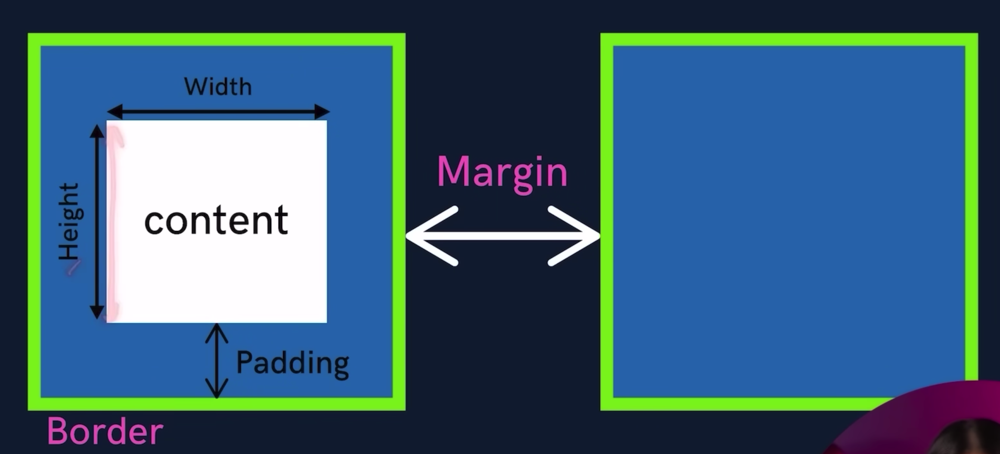

# Box Model :

-   Every content on a page (wheteher its image, text, button, etc.) is represented in form of a box.
-   

| Property | Description                                                   |
| -------- | ------------------------------------------------------------- |
| Height   | by default, it sets the `content area height` of the element. |
| Width    | by default, it sets the `content area width` of the element.  |
| Border   | used to set an elements border. `border: width style color`   |
| Padding  | adds space b/w border and content.                            |
| Margin   | adds space after the border and in b/w other elements.        |

-   Border :

    -   `border: width style color;` : is shorthand for below properties.
        -   `border-width: 5px;`
        -   `border-style: solid;` (solid | dotted | dashed)
        -   `border-color: black;`
    -   `border-radius:` : used to round the corners of an element's outer border edge.
        -   border-radius: 10px; (50% | 10px |).

-   Padding :

    -   `padding: 10px` : shorthand for padding on all 4 sides.
    -   (padding-top | padding-right | padding-bottom | padding-left) --> Clockwise.

-   Margin :
    -   if there is extra width/space available on anyside (ie more than the mentioned space), then margin will extend till the given space.
    -   `margin: 5px` : shorthand for margin on all 4 sides.
    -   (margin-top | margin-right | margin-bottom | margin-left) --> Clockwise.
